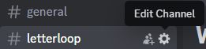
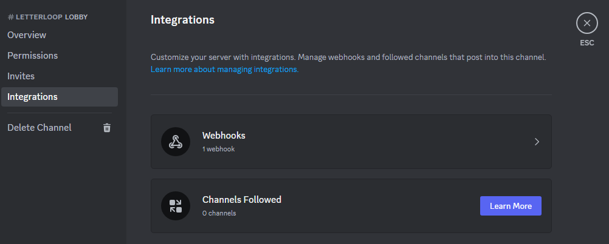
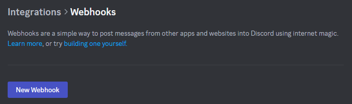
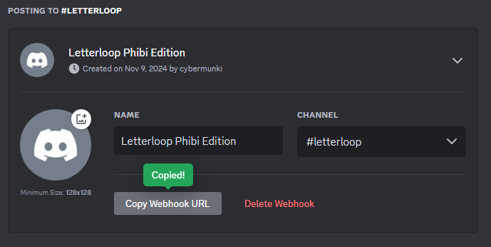

# Letterloop Phibi Edition

Letterloop Phibi Edition is a free alternative to LetterLoop which is only free for the first two issues. Letterloop Phibi Edition helps individuals update each other in monthly issues with all the spicy tea and pics from the previous month. This is implemented using service accounts to keep everyone in suspense (no sneak peeks at responses), but can all be set up to execute as the user account.

## Building

Every push to main will update the crontab code on the Ubuntu server
the cronjobs to run are in the file cronjobs

## Architecture

schedule python scripts to run periodically with crontab -e on ubuntu server

(github stores the crontab file that schedules the scripts and the various scripts to run)
(setup ubuntu server to listen to github actions to update code and run crontabs)
(set up google service account to create and manage forms so that users cannot edit / view them easily)

### Core Files

create_form.py

- runs at the on the 1st of every month
- creates a google form with a sharable link in a specified folder
- toggle setting to allow users to edit their responses after submitting (currently not supported)
- set permissions so that everyone with the link can edit the google form
- send link to discord channel via webhook

collect_responses.py

- runs on the 21st of every month
- changes permission so that form is not editable
- send link to discord channel via webhook

share_responses.py

- runs on the 28th of every month
- create google doc with all responses and photos
  - responses are split per question and then per person
- comments can be added like with a normal google doc
- send link to discord channel via webhook

add_questions_reminder.py

- runs on the 20th of every month
- send discord message to remind that it's last day to submit questions

submission_reminder.py

- runs on the 27th of every month
- send discord message to remind that it's last day to submit responses

last_hour_reminder.py

- runs at 22:59 on the 27th of every month
- send discord message for last hour reminders to submit responses

(optional)
reminders.py

- runs a day before share_responses run
- boot up discord bot to remind people who haven’t submitted
- this means bot will have to maintain a set of people who are in letterloop and a set of people who have submitted the form
- this could mean maybe give bot access to user and roles in the server
- this could mean have a field in form to specify discord username or email
- the above notifications will be sent to everyone in the specified channel rather than per person

### Helper files

database.py and database

- stores the form_id of the created google form for ease of access

googleCred.py

- returns the google credentials

defaultForm.py

- contains default questions to populate the FredderLoop

discordBot.py

- has a function to send a single message to discord server

utils.docUtil.py

- contains the functions to interact with the Docs and create the newsletter

utils.driveUtil.py

- contains the functions to interact with the Drive instance like file permissions

create_newsletter.py

- contains the function to process the form and responses to create the newsletter in a Doc

services.py

- contains a generic function to create specified service, eliminating version mismatch

constants.py

- contains the various service names and versions
- TODO: move contents to `services.py`, not necessary to live in separate file

## Local Development

This section describes how to get started from scratch.

### Requirements

- python3 >= 3.10.7
- pip
- python3.10-venv
- Google Cloud project
- Google credentials
- Google service account

### Setting up the Google Cloud project/credentials

This [python quickstart guide](https://developers.google.com/forms/api/quickstart/python) can be used as a reference for most of the steps. Deviations or additional steps are noted below

#### API Scopes

Below are the required API scopes for this project.

- Google Forms API - Used to interact with Google Forms
- Google Docs API - Used to create the Newsletter in a Google Doc
- Google Drive API - `https://www.googleapis.com/auth/drive.file`, Create new Drive files, or modify existing files, that you open with an app or that the user shares with an app while using the Google Picker API or the app's file picker.

### config.py

`config.py` should be used to store credentials, but should NEVER be pushed with production secrets.

**Note**: The credentials and tokens do not need to be generated to modify a current setup and instructions are present for creating your own setup.

```text
SERVICE_ACCOUNT_CREDENTIALS=<name of json file containing service account key>
GOOGLE_DRIVE_FOLDER_ID=<last segment of google drive folder url (after last "/") for form location>
NEWSLETTER_FOLDER_ID=<last segment of google drive folder url (after last "/") for newsletter docs location>
DISCORD_LETTERLOOP_WEBHOOK=<discord channel webhook, see below for creating>
DISCORD_LETTERLOOP_DEV_WEBHOOK=<discord channel webhook (used for separate dev/testing channel), see below for creating>
```

### SERVICE_ACCOUNT_CREDENTIALS

Follow the Google Forms quickstart guide and you can download this json file after adding a key to the service account.

### local environment

Use the following to create and start a virtual environment with the required python libraries installed.

```bash
python3 -m venv .venv
source .venv/bin/activate
pip install -r requirements.txt
```

**Note**: Use `deactivate` to exit out of the virtual environment

### Discord webhook

1. Go to Channel settings\

2. Go to the "Integrations" page\

3. Click on "Webhook"\
4. Click "New Webhook"\

5. Edit name, target channel, image, and copy webhook url\

6. Save the Webhook URL in the `config.py` file

### Google API Documentation

- [Drive v3 API Documentation](https://googleapis.github.io/google-api-python-client/docs/dyn/drive_v3.html)
- [Docs v1 API Documentation](https://googleapis.github.io/google-api-python-client/docs/dyn/docs_v1.html)
- [Forms v1 API Documentation](https://googleapis.github.io/google-api-python-client/docs/dyn/forms_v1.html)
